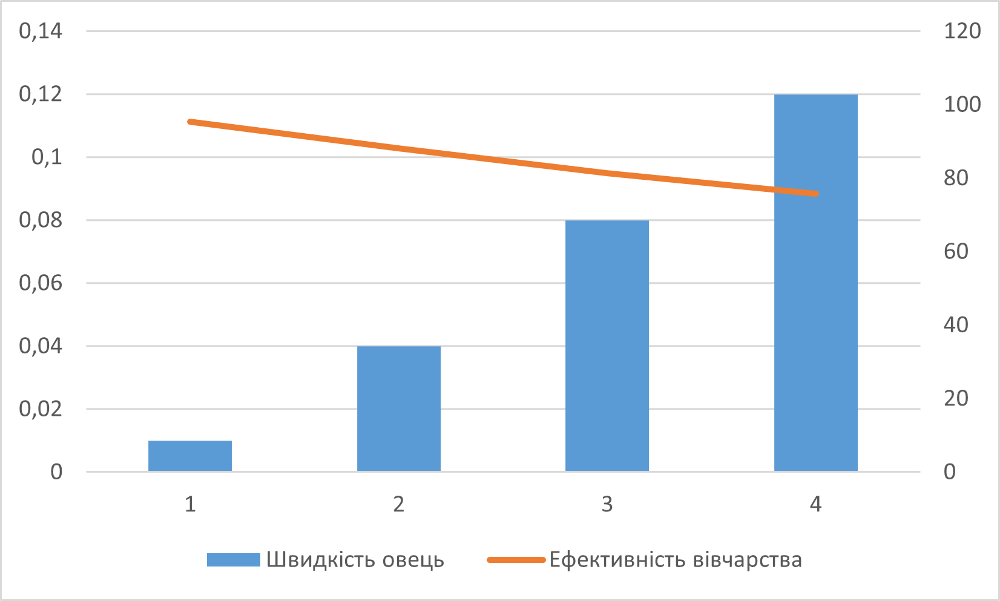
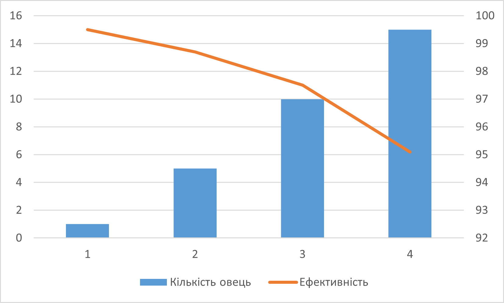
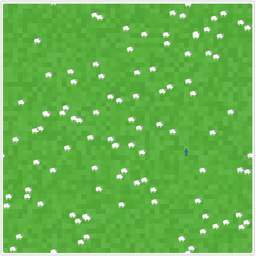
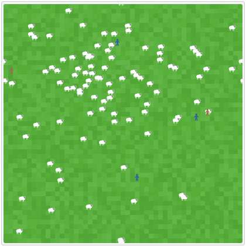
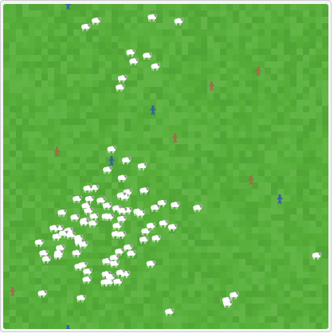
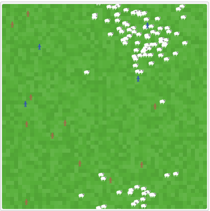
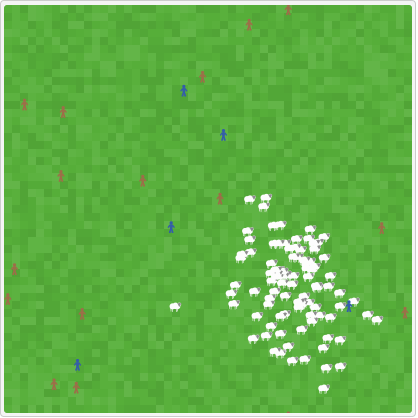
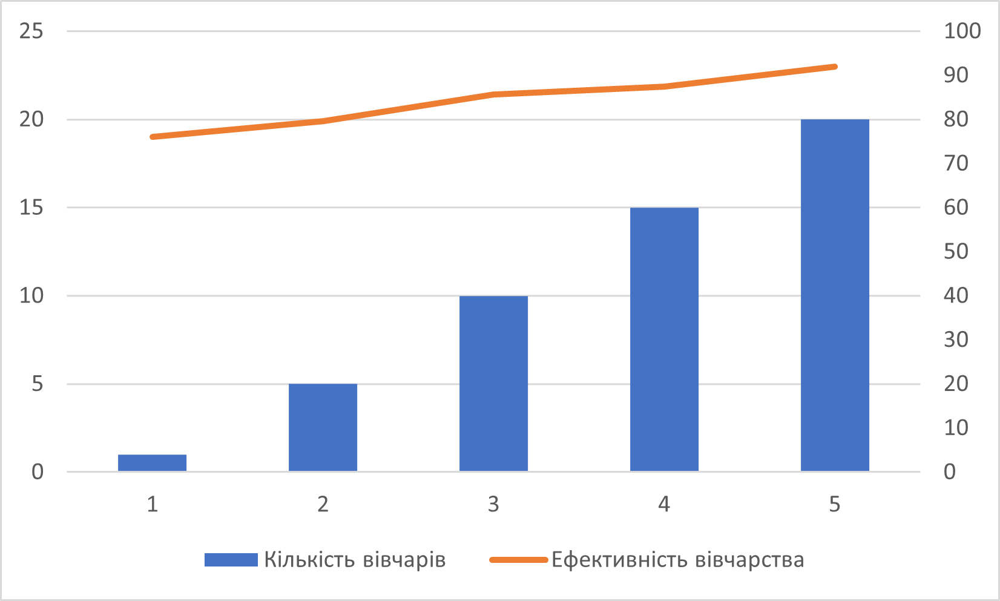

## СПм-23-3, Копайло Ярослав Русланович
### Лабораторна робота №**1**. Опис імітаційних моделей та проведення обчислювальних експериментів

 

### Варіант 9, модель у середовищі NetLogo:
[Shepherds](http://www.netlogoweb.org/launch#http://www.netlogoweb.org/assets/modelslib/Sample%20Models/Biology/Shepherds.nlogo)

 

### Вербальний опис моделі:
Цей проект базується на двох більш простих моделях: термітів, які збирають тріски в купи, і рухомих овець. У цій моделі вівці випадково блукають, а пастухи намагаються їх згуртувати. Чи зберуться вівці в одне стадо, залежить від кількості пастухів і їх швидкості порівняно з вівцями.

Пастухи дотримуються простого набору правил. Кожен пастух починає з випадкового блукання. Якщо він зустрічає вівцю, він піднімає її і продовжує блукати випадково. Коли він натрапляє на іншу вівцю, він знаходить вільне місце поруч, кладе свою вівцю і починає шукати іншу.

### Параметри ініціалізації:
- **num-shepherds** - початкова кількість пастухів.
- **num-sheep** - початкова кількість овець.

### Параметри, що можуть впливати під час симуляції:
- **sheep-speed** - швидкість руху овець.

### Показники системи:
- current efficiency - відображає поточну ефективність випасання.
- Herding Efficiency - графік, що показує ефективність випасання протягом симуляції.

### Примітки:
1) Коли починають формуватися малі стада, вони не "захищені". Тобто пастухи іноді забирають овець з уже існуючих стад.
2) Якщо пастухів недостатньо, або якщо вівці рухаються досить швидко відносно пастухів, пастухи не встигають за вівцями, і ті розходяться.

### Недоліки моделі:
1) Вівці та пастухи не можуть розмножуватися. Було б цікаво спостерігати, як одне покоління пастухів змінює інше, і аналогічно з вівцями.
2) Відсутність хижаків робить модель нереалістичною.
3) Якщо пастухів достатньо і/або вони рухаються значно швидше за овець, кількість стад зменшується з часом. Деякі стада зникають, коли пастухи забирають усіх овець. Якщо б вівці не рухалися взагалі, було б неможливо створити нове стадо з нуля, оскільки пастухи завжди ставлять своїх овець поруч з іншими вівцями. Таким чином, кількість стад обов'язково зменшується з часом.

## Обчислювальні експерименти

### 1. Вплив швидкості овець на ефективність випасання
Досліджується, як параметр **sheep-speed** впливає на **current efficiency**.
Експеримент проводився тривалістю в 10000 тактів при таких параметрах:
- **num-sheep** 100
- **num-shepherds** 20

<table>
<thead>
<tr><th>Швидкість овець</th><th>Ефективність</th><th>Візуальний аналіз</th></tr>
</thead>
<tbody>
<tr><td>0,01</td><td>95.3</td><td>Пастухам дуже легко тримати повільних овець в одному стаді.</td></tr>
<tr><td>0,04</td><td>88.2</td><td>Стає складніше, але пастухи ще справляються.</td></tr>
<tr><td>0,08</td><td>81.3</td><td>Пастухи намагаються утримати овець в одному місці, але це важко, оскільки вівці постійно розходяться.</td></tr>
<tr><td>0,12</td><td>75.7</td><td>Неможливо утримати навіть 10 овець в одному місці. На цьому експеримент був завершений.</td></tr>
</tbody>
</table>

Графік чітко показує, що з підвищенням швидкості овець пастухам стає складніше їх утримувати.

### 2. Кількість овець, яких може утримати один пастух у групі
Досліджується вплив параметра **num-sheep** на **current efficiency**.
Експеримент проводився тривалістю в 20000 тактів при таких параметрах:
- **num-shepherds** 1
- **sheep-speed** 0,02

<table>
<thead>
<tr><th>Кількість овець</th><th>Ефективність</th><th>Візуальний аналіз</th></tr>
</thead>
<tbody>
<tr><td>2</td><td>99.5</td><td>Пастух здатний випасати двох овець.</td></tr>
<tr><td>5</td><td>98.7</td><td>Стає складніше, але пастух ще справляється.</td></tr>
<tr><td>10</td><td>97.5</td><td>Пастух намагається утримати овець разом, але це вдається погано - вони постійно розходяться.</td></tr>
<tr><td>15</td><td>95.1</td><td>Пастух не зміг створити жодного стада. На цьому експеримент було зупинено.</td></tr>
</tbody>
</table>

Під час експерименту було помічено, що один пастух може випасати до 10 овець.

### 3. Визначення мінімальної кількості пастухів, необхідних для випасання певної кількості овець
Досліджувалася мінімальна кількість пастухів, необхідних для випасання 30 овець протягом 10000 тактів.
Експеримент проводився з такими параметрами:
- **num-sheep** 100
- **sheep-speed** 0,04

<table>
<thead>
<tr><th>Кількість пастухів</th><th>Ефективність</th><th>Візуальний аналіз</th></tr>
</thead>
<tbody>
<tr><td>1</td><td>76.1</td><td>Як видно зі скриншоту, пастух зовсім не може впоратися з поставленим завданням.</td></tr>
<tr><td>5</td><td>79.6</td><td>5 пастухів почали збирати стадо, але багато овець поза стадом. Потрібно більше часу або пастухів.</td></tr>
<tr><td>10</td><td>85.6</td><td>Пастухи майже виконали завдання, але ще є декілька овець, що розходяться.</td></tr>
<tr><td>15</td><td>87.5</td><td>Пастухи здатні утримувати стадо. 1-7 овець розходяться, але їх швидко повертають.</td></tr>
<tr><td>20</td><td>92</td><td>Пастухи бездоганно виконують свою роботу. На цьому експеримент було завершено.</td></tr>
</tbody>
</table>

Належні зображення, отримані під час дослідження:

1 пастух:

5 пастухів:

10 пастухів:

15 пастухів:

20 пастухів:

Графік:

Графік наочно показує, що чим більше пастухів, тим краще вони виконують свою роботу.
