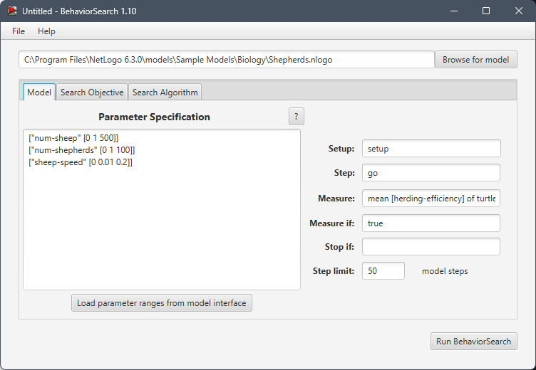
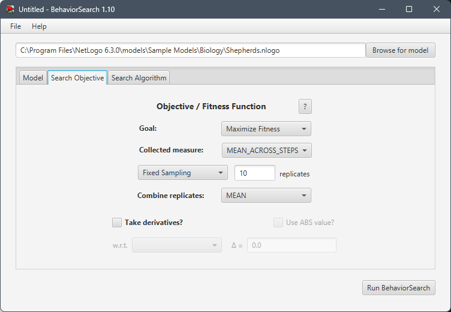
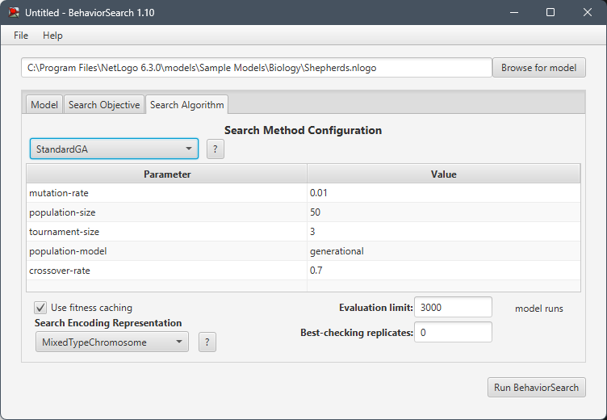
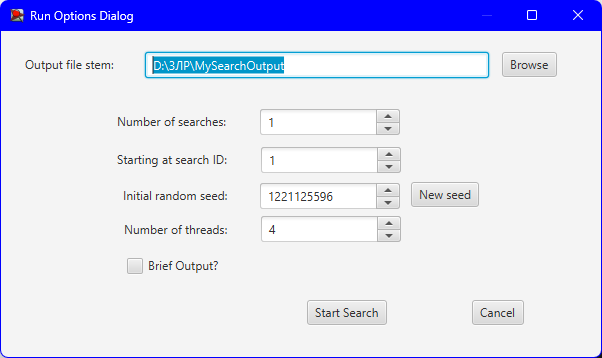
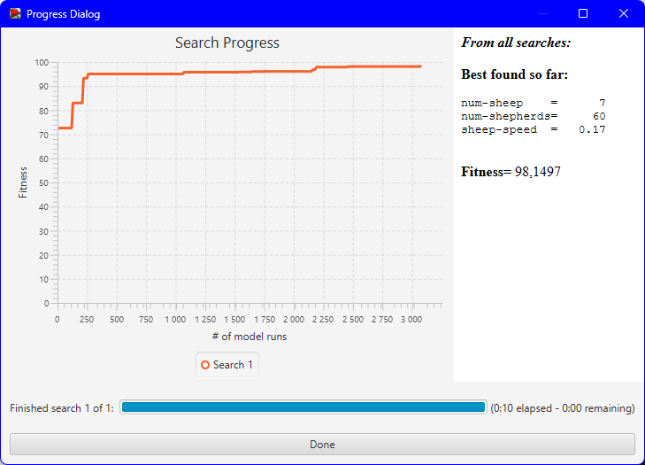

## СПм-23-3, Копайло Ярослав Русланович
### Лабораторна робота №**3**. Використання засобів обчислювального інтелекту для оптимізації імітаційних моделей

 

### Варіант 9, модель у середовищі NetLogo:
[Shepherds](http://www.netlogoweb.org/launch#http://www.netlogoweb.org/assets/modelslib/Sample%20Models/Biology/Shepherds.nlogo)

 

### Вербальний опис моделі:
Цей проєкт базується на двох простіших моделях: термітів, які збирають тріски в купи, та рухомих овець. У цьому проєкті вівці хаотично блукають, а пастухи ходять, намагаючись їх випасати. Чи опиняться вівці в одному стаді, залежить від кількості пастухів і від того, наскільки швидко вони рухаються порівняно з вівцями.

Пастухи дотримуються простого набору правил. Кожен пастух починає випадково блукати. Якщо він зустрічає вівцю, він підбирає її та продовжує випадкове блукання. Коли він натикається на іншу вівцю, він знаходить вільне місце поруч, кладе свою вівцю і шукає наступну.

### Параметри початкової установки:
- **num-shepherds** — кількість пастухів на початку.
- **num-sheep** — кількість овець на початку.

### Параметри, що можуть впливати під час симуляції:
- **sheep-speed** — швидкість овець.

### Показники роботи системи:
- current efficiency — відображає поточну ефективність випасання.
- Herding Efficiency — графік, що демонструє ефективність випасання протягом симуляції.

 

### Налаштування середовища BehaviorSearch:

**Обрана модель**:
<pre>
C:\Program Files\NetLogo 6.3.0\models\Sample Models\Biology\Shepherds.nlogo
</pre>

**Параметри моделі** (вкладка Model):

*Параметри та їх можливі діапазони були **автоматично** отримані середовищем BehaviorSearch із вибраної імітаційної моделі за допомогою кнопки «Завантажити діапазони параметрів із інтерфейсу моделі»*:

<pre>
["num-sheep" [0 1 500]]
["num-shepherds" [0 1 100]]
["sheep-speed" [0 0.01 0.2]]
</pre>

Використовувана **міра**:  
Для фітнес-функції *(також відомої як функція пристосованості або цільова функція)* було обрано **значення середньої ефективності** і вказано у параметрі "**Measure**":
<pre>
mean [herding-efficiency] of turtles
</pre>

Середня ефективність усіх здобувачів повинна враховуватися **в середньому** за весь період симуляції тривалістю 3000 тактів, починаючи з 0-го такту симуляції.  
*Параметр "**Measure if**" зі значенням true означає, що будуть враховані всі такти симуляції, а не лише частина. Іноді доцільно не враховувати початкові такти через хаос у деяких моделях на початку роботи. Це показано в прикладі з документації BehaviorSearch.  
Параметри "**Setup**" та "**Go**" вказують відповідні процедури ініціалізації та запуску в логіці моделі (зазвичай вони так і називаються). BehaviorSearch під час роботи фактично виконує ці процедури замість користувача.*  
Параметр зупинки за умовою ("**Stop if**") у цьому випадку не використовувався.

Загальний вигляд вкладки налаштувань параметрів моделі:

**Налаштування цільової функції** (вкладка Search Objective):  
Метою підбору параметрів імітаційної моделі є **максимізація** значення середньої енергії здобувачів — це вказано через параметр "**Goal**" зі значенням **Maximize Fitness**. Тобто необхідно визначити такі параметри налаштувань моделі, при яких здобувачі в процесі життя та розмноження покращують середнє значення енергії в окремого здобувача. При цьому цікавить не просто середня швидкість усіх машин у певний момент симуляції, а середнє її значення за всю симуляцію (тривалість якої (3000 кроків) була вказана на попередній вкладці). Для цього в параметрі "**Collected measure**", що визначає спосіб обліку значень обраного показника, вказано **MEAN_ACROSS_STEPS**.  
Щоб уникнути викривлення результатів через випадкові значення, що використовуються в логіці самої імітаційної моделі, **кожна симуляція повторюється по 10 разів**, і результуюче значення розраховується як **середнє арифметичне**.

Загальний вигляд вкладки налаштувань цільової функції:

**Налаштування алгоритму пошуку** (вкладка Search Algorithm):

Загальний вигляд вкладки налаштувань алгоритму пошуку для Генетичного алгоритму:

Загальний вигляд вкладки налаштувань алгоритму пошуку для Випадкового пошуку:

 

### Результати використання BehaviorSearch:

Діалогове вікно запуску пошуку:

Результат пошуку параметрів імітаційної моделі, використовуючи **генетичний алгоритм**:

Результат пошуку параметрів імітаційної моделі, використовуючи **випадковий пошук**:

Аналізуючи результати пошуку, можна помітити, що при використанні випадкового пошуку значення фітнес-функції вище, ніж при застосуванні генетичного алгоритму. Однак у випадку випадкового пошуку кількість овець наприкінці пошуку завжди дорівнює 0. З огляду на це, випадковий пошук не можна вважати доцільним.
